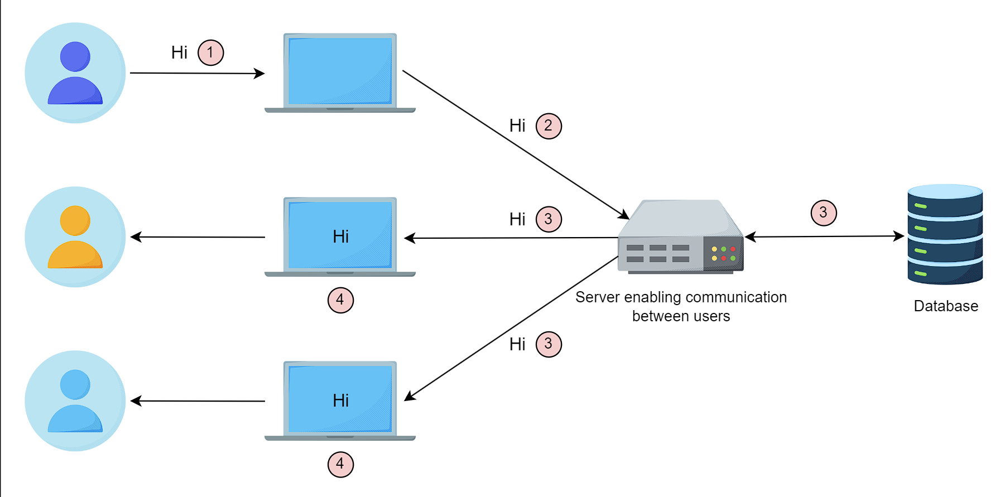

# Distributed Chatroom Application

I built a real-time group chat application using the Elixir programming language to demonstrate its capabilities in distributed systems communication. By integrating Elixir, the Phoenix framework, Phoenix Channels, and PostgreSQL for message storage, this project showcases how Elixir effectively handles real-time group messaging across multiple nodes. The diagram below illustrates the application's architecture, highlighting its distributed system features.

## Requirements

1. Erlang/OTP
2. Elixir
3. PostgreSQL

## Getting Started

To start your Phoenix server:

1. Install dependencies with `mix deps.get`
2. Create and migrate your database with `mix ecto.setup`
3. Install Node.js dependencies with `npm install` inside the `assets` directory
4. Start the Phoenix endpoint with `mix phx.server`

Now you can visit [`localhost:4000`](http://localhost:4000) from your browser.

## Production Deployment

Ready to run in production? Please [check our deployment guides](https://hexdocs.pm/phoenix/deployment.html).

## Learn More

- Official website: [Phoenix Framework](https://www.phoenixframework.org/)
- Guides: [Phoenix Guides](https://hexdocs.pm/phoenix/overview.html)
- Docs: [Phoenix Documentation](https://hexdocs.pm/phoenix)
- Forum: [Elixir Forum - Phoenix](https://elixirforum.com/c/phoenix-forum)
- Source: [Phoenix GitHub Repository](https://github.com/phoenixframework/phoenix)
